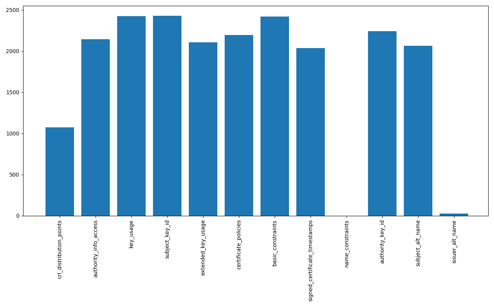
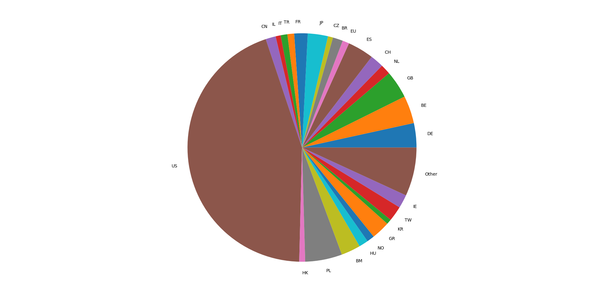
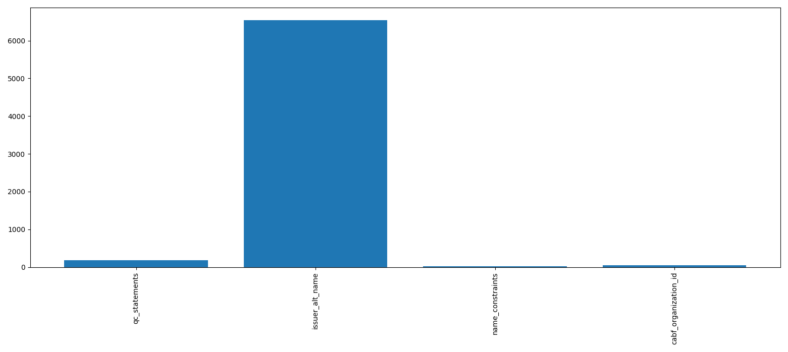

# The TLS Observatory

For instructions on how to use the code view [USAGE.md](USAGE.md)

## Background

In 2010, the EFF created the SSL Observatory, “a project to investigate the certificates used to secure all of the sites encrypted with HTTPS on the Web.”
Peter Eckersley and Jesse Burns presented their results at DEF CON 18 and 27C3 where they found all kinds of wacky stuff such as private key sharing, weak keys, and certs for unqualified domains (ex. Localhost, mail, etc.).
The goal of this project, the TLS observatory, is to re-run these experiments and see how things have changed.

What was found is that while CAs have improved in some areas they are still abusing some functionality of certificates (key sharing and key reusing) and using insecure cryptographic algorithms (SHA1-RSA and 1024 bit RSA keys).
One improvement is that the number of CA organizations has decreased which makes it more feasible to verify who we trust.

## Differences with the EFF SSL Observatory

A lot has changed on the web since the first SSL Observatory experiments.
Back in 2010 you could scan the IPv4 space and pretty much access all the public facing websites on the Internet.
Since the addition of server name indication (SNI), you now need to know the domain of the website in order to get its certificates.
In addition to SNI, many other technological advances require an adapted approach to recreate the SSL Observatory experiments.

The SSL Observatory used custom scripts and OpenSSL patches to gather and parse their data.
As TLS has added new versions and cipher suites since 2010, these scripts would not be reusable.
Luckily, the ZMap project exists which provides tools to easily scan the Internet and grab TLS certificates (using zgrab2).
This means that no custom TLS or scanning code is needed.
This also means that this project should be reusable as long as zgrab2 is kept updated (note that this also depends on go 1.15 and mongoDB).

One other difference is that not all analyses that were run in the SSL Observatory were run in the TLS Observatory due to time constraints.

## Hypothesis

Given that a project like the SSL Observatory existed in 2010 and many other web security research projects have been created since, I would expect that the security of the web would have improved overall.
While I am optimistic, I am still skeptical that all of the problematic behavior has stopped and expect for CAs to still exhibit some weird behavior.

## Methodology
### 1. Collect domains from Certificate Transparency Logs
In the original SSL Observatory project, the IPv4 address space was scanned.
Back then this pretty much represented the web but, now SNI allows many websites to be behind one IP address.
This means we need to know the domain name to get the certificates for that website. \
\
This can be solved by scraping domain names from certificates in the certificate transparency logs.
This allows us to get a large amount of domain names giving us a larger sample size.
Unfortunately, this biases the data as the domains we have are only from CAs that participate in CT logging.
The tool I used to scrape the domains can be found at [ctlog-scrape-go](https://github.com/PinkNoize/ctlog-scrape-go). For more information on certificate transparency logs visit [Certificate Transparency](https://certificate.transparency.dev/) and [Merkle Town](https://ct.cloudflare.com/).

### 2. Collect root certificates from various major platforms
In order to verify if a certificate is valid and trusted it must be verified against root certificates. The trust stores (collection of trusted root certificates) used in this project are from [nabla-c0d3's trust_stores_observatory](https://github.com/nabla-c0d3/trust_stores_observatory) which includes trust stores from:
- Apple
- Google Android
- Microsoft Windows
- Mozilla NSS
- Oracle Java
- OpenJDK

### 3. Collect TLS certificates from the Internet
To gather the data we have to scan the IPv4 space and the domains scraped from the CTLogs.
Due to limited time and resources, only %1 of scraped domains were sampled at random to be scanned (30,461,151 reachable domains).
All public IPv4 addresses were scanned (23,894,069 IP addresses listening for TLS connections on port 443).
As each website is scanned its TLS information and certificates are put in a mongodb database.

The tool I wrote to scan websites can be found at [tls-observatory](https://github.com/PinkNoize/tls-observatory).
It is essentially a fancy way of running `cat domains ipv4address | zgrab2 tls | resultParser` where resultParser is some code that puts the results in the mongodb collections.

### 4. Validate Certificates

Each site is validated using go’s [x509 Verify](https://golang.org/pkg/crypto/x509/#Certificate.Verify) against each root trust store using the provided certificate chain from each website.
In the case of IP addresses, the site is verified against the IP address as there is no domain name.
Note that no revocation checking is done.

This project also checks for transvalid sites.
Transvalid sites are sites that are invalid using the provided certificate chain but are valid if the right intermediate certificates are cached.
To a user browsing the web this would look like an invalid site on a fresh browser but would be valid if the user visited the right sites beforehand.

### 5. Run Analyses

Analyses can be viewed at [tls-observatory](https://github.com/PinkNoize/tls-observatory/USAGE.md#analyses).

## Results

### IPv4
- 23,894,069 reachable TLS servers in the IPv4 space
    - 2,477 (<1%) valid sites when the IP address is used as the server name
        - Used TLS Versions
            - TLSv1.2: 97%
            - TLSv1.0: 3%
        - 136 transvalid sites
    - 2,439 valid certificates
        - 301 Root certificates
            - ~148 Issuer organizations
                - This number is slightly inflated due to orgs using multiple issuer strings
                    - Ex. GlobalSign vs GlobalSign nv-sa
            - Root CA Key Types
                - ECDSA: 13.3%
                - RSA: 86.7%
                    - 4096 bits: 51.72%
                    - 2048 bits: 45.98%
                    - 1024 bits: 2% \
                    While these are insecure they are only used in the Oracle Java trust store.
                    - 3072 bits: 0.3%
        - 382 CA Certificates (including the root certificates)
            - 87 intermediate certificates
            - ~174 Subject organizations
                - This number is also inflated (see root CA for reasoning)
            - CA Certificate Key Signatures
                - SHA1-RSA: 26.7%
                - SHA256-RSA: 46.86%
                - SHA384-RSA: 12.04%
                - SHA512-RSA: 2.88%
                - ECDSA-SHA256: 1.83%
                - ECDSA-SHA384: 9.42%
                - ECDSA-SHA512: 0.26%
        - Certificate Key Types
            - ECDSA: ~3%
            - RSA: 97%
                - 4096 bits: 9.62%
                - 2048 bits: 89.92%
                - 1024 bits: 0.21% \
                These are the same Oracle root CA certificates.
                - 3072 bits: 0.16%
                - 8192 bits: 0.08%
        - Certificate Extension Usage \
        
        It is hard to see from the image but only 1 certificate had name constraints.

### Domains
- 30,461,151 reachable TLS servers scanned by domain
    - 27,559,986 (90.5%) valid sites
        - Used TLS Versions
            - TLSv1.2: 99.97%
            - TLSv1.1: <0.01%
            - TLSv1.0: 0.02%
            - SSLv3: <0.01% (2 sites)
        - 70,504 transvalid sites
    - 21,958,016 valid certificates
        - 2,865 Certificates with an IP address as a name
        - Top Domains
            - sni.cloudflaressl.com - 2,056,687 occurrences
            - tls.automattic.com - 97,011 occurrences
            - *.mcas.ms - 68,178 occurrences
            - ssl.smugmug.com - 2,385 occurrences
            - imperva.com - 1,620 occurrences
        - 884 CA Certificates (including the root certificates)
            - 502 intermediate certificates
            - ~262 Subject organizations
                - GlobalSign has the most of these certificates with 34 certificates
                - This number is also inflated (see root CA for reasoning)
            - CA Certificate Key Signatures
                - SHA1-RSA: 12.78%
                - SHA256-RSA: 59.73%
                - SHA384-RSA: 16.29%
                - SHA512-RSA: 2.49%
                - ECDSA-SHA256: 1.13%
                - ECDSA-SHA384: 16.29%
                - ECDSA-SHA512: 0.11%
            - CA Certificates per country \
            
            - Certificate Key Types
                - ECDSA: 12.5%
                - RSA: 87.5%
                    - 4096 bits: 9.9%
                    - 2048 bits: 89.5%
                    - 3072 bits: 0.66%
                    - 2056-3000 bits: <<1%
                    - 1024 bits: <<1%
            - Certificate Extension Usage
            

One noteworthy change is that the number of CA organizations has decreased by about half (651 -> 262+148) assuming that all CA organizations were collected.

### Key Reuse

In the SSL Observatory it was found that CAs were sharing keys and using keys in multiple certificates to extend the life of a private/public key pair.
There are a few organizations that still share keys (view results/key_reuse.out for raw results):
- DigiCert Inc and Baltimore CyberTrust
- Let’s Encrypt, Internet Security Research Group and Digital Signature Trust Co.

While sharing keys may make managing certificates easier it adds increased risk and complexity to revoke these certificates.
If one of these certificates becomes compromised, not only does that certificate need to be revoked but all the certificates it shares a key with must also be revoked.

Key reuse is still also being used to extend the life of keys by:
- Chunghwa Telecom Co.
    - Two certs with this key expire at 2034-12-20 while a third cert expires at 2037-12-31
- Verisign Inc.
    - One cert expires at 2022-11-05 while another expires at 2028-04-02
- Starfield Technologies Inc.
    - One cert expires at 2037-12-31 while another expires at 2038-01-17
- Digicert
    - One cert expires at 2025-05-10 while another expires at 2031-11-10
- Apple Inc.
    - One cert expires at 2025-02-10 while another expires at 2035-02-09
- And quite a few more

While key reuse may make managing keys easier it circumvents the purpose of a certificate expiration and contradicts certificate best practices.
